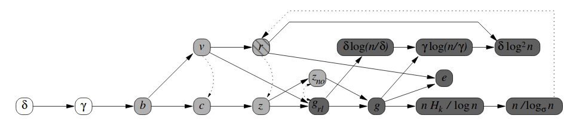

# Строковые алгоритмы сжатия

## Алгоритмы сжатия в нашей жизни
Сжатие - преобразование данных, уменьшающее их объём
- Примеры сжатия из реальной жизни:
    * Война и мир: 747323 символа. Краткий пересказ: 68509 символов
    * Ускоренный темп речь
    * Рефакторинг кода
- Почти все примеры из реальной жизни - алгоритмы сжатия с потерями
    * Из пересказа Войны и мир нельзя узнать какого цвета были глаза у Наташи Ростовой
- Конкретные алгоритмы сжатия без потерь применяются уже для решения технических задач
    * gzip, brotli - сжатия компонентов веб-сайтов (CSS, HTML, JS)
    * lz4 - сжатие данных в Cassandr-е

## Зачем нужно сжимать данные?
- Сжатые данные занимают меньше места
- Сжатые данные могут более структурированно представлять исходные данные.
    - Это может позволить выполнять некоторые операции эффективнее над сжатым представлением, чем над оригинальным
    - 0110101000101000101000100000101000001000101000100
    - len(s) = 50, s[i] = 1 <-> (i+1) - простое число

## Немного терминологии
- Мы будем рассматривать алгоритмы сжатия для строк - последовательности символов из некоторого алфавита
    - s_1 = "атмосфера неравнодушных споров" - строка из 30 символов (|s_1| = 30) русского алфавита и пробела
    - s_2 = "01101001" - строка из 8 символов (|s_2| = 8) бинарного алфавита
    - s_3 = "AGCTTGAA" - строка из 8 символов (|s_3| = 8) алфавита азотистых оснований ДНК
- Мы будем рассматривать алгоритмы сжатия без потерь
    - Алгоритм сжатия A - это пара преобразований A = (Encode, Decode)
    - Decode(s) - шифр строки s
    - Для любой строки s верно, что Decode(Encode(s)) = s
    - Пример "алгоритм сжатия": Encode(s) = ss, Decode(ss) = s
        * Encode("hi") = "hihi"
        * Decode("hihi") = "hi"
        * Decode("abc") = new InvalidProgramStateException(...)

- Часто используются конвеер из нескольких алгоритмов сжатия:
    - Например, пусть мы сжимаем человеческую речь
    - A1 = (Encode1, Decode1) - преобразует wav файл в текстовые данные
    - A2 = (Encode2, Decode2) - преобразует текстовые данные в бинарный файл

## Небольшое упражнение
- Пусть есть пара алгоритмов сжатия строк над бинарным алфавитом, шифр для которых тоже является бинарной строкой
    - A1 = (Encode1, Decode1)
    - A2 = (Encode2, Decode2)
- Как построить алгоритм сжатия A3 = (Encode3, Decode3), который не сильно хуже каждого из алгоритмов A1, A2?
    * |Encode3(s)| = min(|Encode1(s)|, |Encode2(s)|)
- Encode3(s) = { 0Encode1(s), если |Encode1(s)| < |Encode2(s)|, 1Encode2(s), иначе }

## Плохие новости
- Рассмотрим набор всех бинарных строк длиной не более 10 символов:
    * 0, 1, 00, 01, 10, 11, 000, 001, 010, 011, 100, 101, 110, 111, ...
- Рассмотрим алгоритмы сжатия бинарных строк, шифр для которых тоже является бинарной строкой
- Сколько существует таких алгоритмов сжатия, что шифр для каждой строки из набора не длиннее чем исходная строка?
    * Encode(x) = { 1y, если x = yy, 0x, иначе }
    * Encode(00010001) = 00001, |00001| < |00010001|
    * Encode(00010011) = 100010011, |100010011| > |00010011|
    * Существует ровно один алгоритм с таким свойством:
        * Encode(x) = x, Decode(x) = x
- Для любого нетривиального алгоритма сжатия без потерь существует строка, у которой шифр длиннее исходной строки

## Зачем тогда нужны алгоритмы сжатия?
- Мы работаем со строками с определенной структурой, а не со случайными строками
    * Чтобы сохранить все строки длиной в 64 бита нужно 1073741824 ТБ памяти
    * EDI за все время своего существования хранит десятки ТБ информации
    * Почти все строки - случайные и несжимаемые

## Как оценить степень сжимаемости строки?

- 01101001100101101001011001101001
- abcabcabcabcabcabcabcabcabcabc
- abacabadabacabaeabacabadabacaba

- babaaabaaaaaaabaaaabaaaaaaaaaaba

- abcdefghijklmnopqrstuvwxyzabcde
- bgaehbcfggheefbchfacbagbaagbaehg

- Колмогоровская сложность
- Размер минимального аттрактора
- Размер минимальной прямолинейной программы
- Количество фраз в Лемпель-Зив разложении строки
- Максимальная плотность количества различных подстрок фиксированной длины

## Колмогоровская сложность
- Размер минимальной программы, которая генерирует заданную строку
    * abcabcabcabcabcabcabcabcabcabc
    * print("abc" * 10)
    * K("abcabcabcabcabcabcabcabcabcabc") <= 17

- Колмогоровская сложность строки - невычислимая функция
    * Не существует программы, которая принимает на вход строку s, а выдает K(s)
    * Попытка написать такую программу приведет к образованию чёрной дыры
    * Попытка написать такую программу приведет к тому, что полученная программа либо зацикливается, либо работает неверно

- Опять плохие новости: идеальной степени сжатия достичь невозможно

## Размер минимального аттрактора
- Аттрактор - такой набор позиций, что любая подстрока имеет вхождение, пересекающую хотя бы одну позицию из набора
- Опять плохие новости: задача нахождения минимального аттрактора - NP-полная
    * Грубо говоря: если для строк длины n минимальный аттрактор на компе разработчика можно найти за T секунд, то для строк длины n + 1 поиск будет занимать ~2T секунд

- Упражнение на дом для желающих:
    * Найти размер минимального аттрактора для строк Туэ-Морса (Kutsukake, Kanaru, et al. "On repetitiveness measures of Thue-Morse words.", 2020)
        - 01101001100101101001011001101001

## Размер минимальной прямолинейной программы
- Прямолинейная программа - программа на C#, где разрешены только выражения вида:
    * var x = "...";
    * var y = a + b + c;

    * var a1 = "a";
    * var a2 = "b";
    * var a3 = a1 + a2;
    * var a4 = a3 + a3;
    * var a5 = a4 + a3; // a5 = ababab

- Размер прямолинейной программы - сумма длин правых частей выражений
- Опять плохие новости: задача нахождения минимальной прямолинейной программы - NP-полная

## Лемпль-Зив разложение строки
- Лемпель-Зив - наверное самый популярный алгоритм сжатия
    * Придуман в 1977 году 
    * До сих пор активно используется как в теории, так и в практике
- Идея построения разложения - подстроки, которые встречались ранее можно заменять на ссылки и не записывать явно
    * abacabadabacaba
    * ab[a]c[aba]d[abacaba]
    * ab(0, 1)c(0, 3)d(0, 7)

## Максимальная плотность количества рзаличных подстрок фиксированной длины
- S(k) - множество всех различных подстрок длины k для строки s
- Оценка сжимаемости строки - max { S(k) / k } (Raskhodnikova et al., Sublinear algorithms for approximating string compressibility, 2013)
    * abacabadabacaba
    * S(1) = {a, b, c, d}, S(1) / 1 = 4
    * S(2) = {ab, ba, ac, ca, ad, da} = 6, S(2) / 2 = 3
    * S(3) = {aba, bac, aca, cab, bad, ada, dab}, S(3) / 3 = 7 / 3

- Хорошие новости: данную оценку можно вычислить быстро - за линейное время!

## Как оценки связаны между собой?

---

## Как оценки связаны между собой?

## Конец
